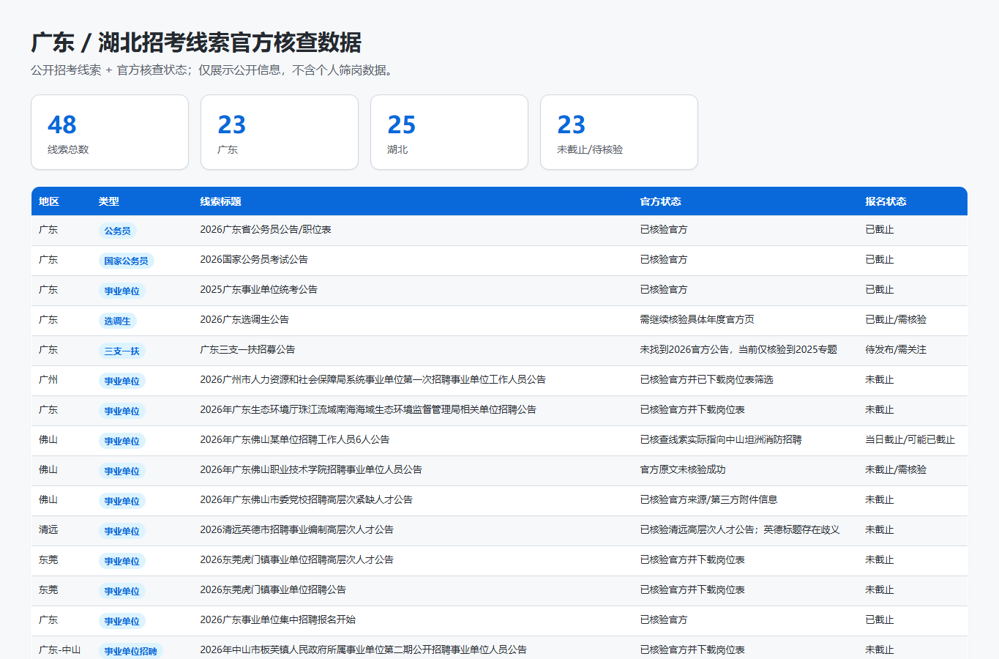
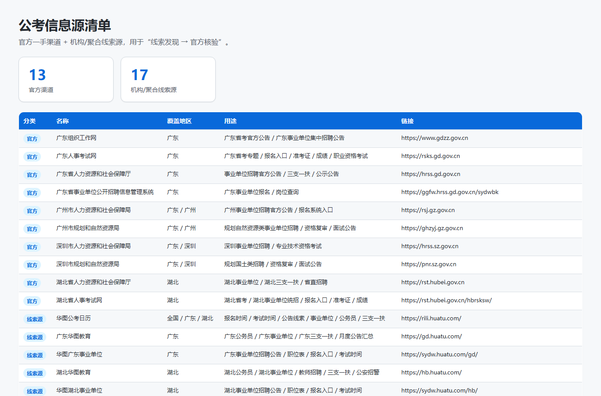
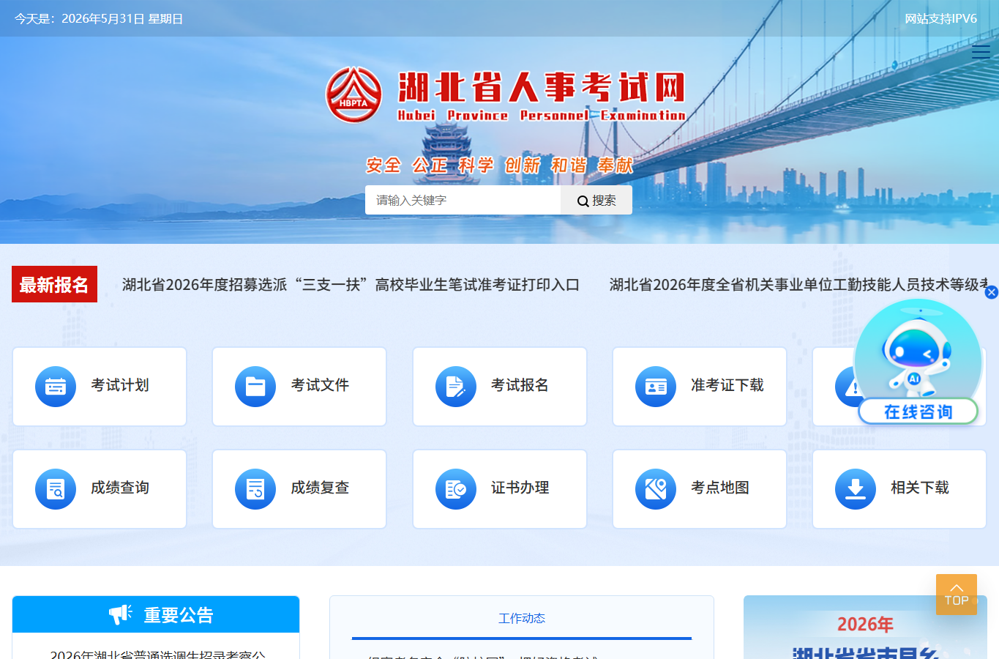
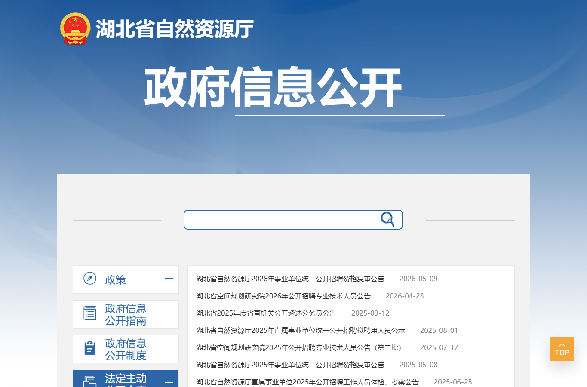

# 公考信息源（Public Exam Info Sources）

这是一个面向公开信息整理的公考信息源仓库，主要收集和标注公务员、事业单位、三支一扶、基层招聘等招考信息的一手官方渠道与部分机构/聚合网站线索。

> 说明：本仓库只整理公开招考信息来源与线索，不包含任何个人报考条件、个人筛岗结果或私人信息。所有招考结论应以官方公告、岗位表和报名系统为准。

## 内容结构

```text
.
├─ data/
│  ├─ official_channels.json                              # 官方信息源清单
│  ├─ guangdong_official_recruitment_sources_2026-06-01.json # 广东省级与21市官方招聘源头
│  ├─ hubei_official_recruitment_sources_2026-06-01.json  # 湖北省级与17地官方招聘源头
│  ├─ aggregator_sources.json                             # 机构/聚合网站线索源清单
│  └─ recruitment_leads_checked_2026-05-31.json           # 已整理线索及官方核查状态
├─ docs/
│  ├─ methodology.md                                      # 信息核查方法
│  ├─ guangdong-official-recruitment-sources-2026-06-01.md # 广东省官方源头说明
│  ├─ hubei-official-recruitment-sources-2026-06-01.md    # 湖北省官方源头说明
│  └─ assets/
│     └─ screenshots/                           # 数据预览与公开网站截图
├─ LICENSE
└─ README.md
```

## 截图预览

### 数据预览

招考线索官方核查数据预览：



信息源清单预览：



### 官方网站示例

广东组织工作网：


湖北省人事考试网：



广东省人力资源和社会保障厅：


湖北省自然资源厅招考录用栏目：



## 数据规模

截至 2026-06-01，信息源清单已补充为：

- 官方/准官方核验渠道：43 个（原始清单）
- 广东省级与 21 个地市官方招聘源头：已单独整理为 `guangdong_official_recruitment_sources_2026-06-01.json`
- 湖北省级与 17 个市州/直管市/林区官方招聘源头：已单独整理为 `hubei_official_recruitment_sources_2026-06-01.json`
- 机构/聚合/报名平台线索源：26 个
- 已整理招考线索：48 条

覆盖范围包括国家级入口、广东省级入口、湖北省级入口，广东 21 个地市人社/考试/教育/卫健/公安官方入口，湖北 17 个市州/直管市/神农架林区人社/考试/教育/卫健/公安官方入口，以及武汉、宜昌、荆门、黄石、潜江等地方人社/人事考试渠道。

## 使用建议

1. 先用 `aggregator_sources.json` 中的机构/聚合网站发现线索。
2. 再用 `official_channels.json` 中的一手渠道核验公告、岗位表、报名入口。
3. 对任何岗位信息，以官方公告、附件岗位表和报名系统资格审查为最终依据。

## 一手来源优先级

通常优先级如下：

1. 组织部 / 公务员局 / 国家公务员局专题网站
2. 省、市、县人社厅/人社局、人事考试网
3. 政府门户网站的招考信息、人事信息、招聘公告栏目
4. 招聘单位官网或主管部门官网
5. 机构网站、培训机构页面、聚合网站（仅作线索，不作最终依据）

## 数据字段说明

`recruitment_leads_checked_2026-05-31.json` 中主要字段：

- `title`：线索标题
- `province` / `region`：省份与地区
- `examType`：考试/招聘类型
- `sourceName` / `sourceUrl`：线索来源
- `officialStatus`：官方核查状态
- `officialTitle` / `officialSource` / `officialUrl`：官方公告信息
- `registration` / `registrationStatus`：报名时间与状态
- `notes`：备注

## 免责声明

本仓库仅做公开信息整理，不保证信息实时、完整或无误。报名、资格审查、考试安排、岗位要求等均以官方最新公告和报名系统为准。
